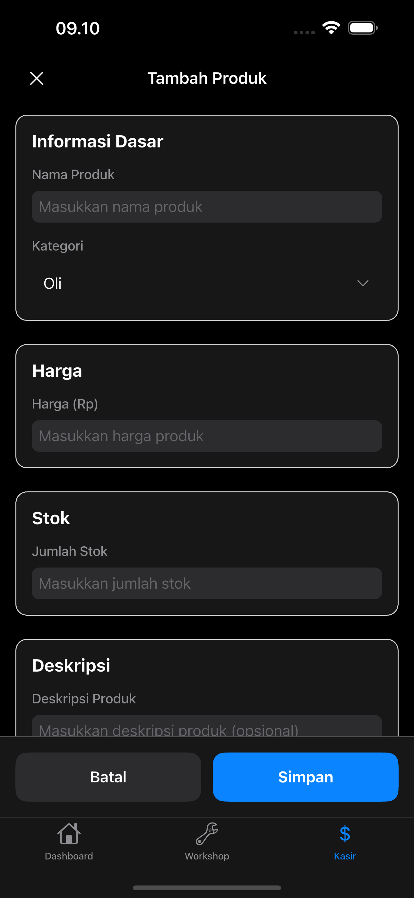

# Workshop Manager & Kasir

Aplikasi manajemen workshop dan kasir untuk bengkel dengan desain bergaya iOS minimalis dan bercahaya. Dikembangkan menggunakan Flutter untuk platform iOS, Android, dan Desktop.

## 📸 Screenshot

### Dashboard

*Dashboard menampilkan statistik harian, kendaraan aktif, dan transaksi terbaru*

### Manajemen Workshop

*Daftar kendaraan dengan status real-time dan filter berdasarkan status*

### Kasir & Transaksi

*Sistem kasir dengan daftar transaksi dan status pembayaran*

### Input Pembayaran Tunai

*Form input pembayaran tunai dengan perhitungan otomatis*

### Pembayaran QRIS

*Halaman pembayaran QRIS dengan kode QR*

### Keranjang Belanja

*Keranjang belanja dengan produk dan layanan yang dipilih*

### Tambah Produk

*Form tambah produk dan layanan baru*

### Riwayat Transaksi

*Daftar riwayat transaksi lengkap dengan detail*

### About App

*Informasi lengkap tentang aplikasi, credits, dan lisensi*

## Fitur Utama

### 🏠 Dashboard
- **Data Real-time**: Menampilkan data langsung dari database
- **Kendaraan Aktif**: Jumlah kendaraan yang belum diserahkan
- **Pendapatan Harian**: Total pendapatan hari ini dari transaksi yang sudah dibayar
- **Transaksi Harian**: Jumlah transaksi yang dibuat hari ini
- **Selesai Hari Ini**: Jumlah kendaraan yang selesai hari ini
- **Tombol Refresh**: Update data terbaru dengan sekali klik
- **Tentang Aplikasi**: Informasi lengkap tentang aplikasi dan pembuat

### 🔧 Workshop Management
- Daftar kendaraan dengan filter berdasarkan status (Menunggu, Proses, Selesai)
- Detail kendaraan lengkap (pelanggan, kendaraan, keluhan, estimasi)
- Update status kendaraan secara real-time
- Tambah kendaraan baru
- Status kendaraan: Menunggu, Dalam Proses, Selesai, Diserahkan

### 💰 Kasir & Transaksi
- Ringkasan transaksi harian dengan total pendapatan
- Daftar transaksi dengan status pembayaran
- Proses pembayaran untuk transaksi pending
- Pilih kendaraan untuk membuat transaksi baru
- Metode pembayaran: Tunai, Transfer Bank, Kartu, QRIS
- Status transaksi: Pending, Lunas, Dibatalkan

### 📱 Fitur Aplikasi
- **Cross-platform**: iOS, Android, dan Desktop (Windows, macOS, Linux)
- **Database Lokal**: SQLite untuk menyimpan data secara lokal
- **Desain iOS Style**: Menggunakan Cupertino Design
- **Tombol Refresh**: Update data terbaru di dashboard
- **About App**: Informasi lengkap tentang aplikasi
- **Dark/Light Mode**: Tema gelap dan terang
- **Responsive Design**: Tampilan yang adaptif

### 🌓 Dark Mode & Light Mode
- Toggle tema gelap dan terang di setiap halaman
- Desain yang konsisten di kedua tema
- Warna yang disesuaikan untuk kenyamanan mata

## Teknologi

- **Framework**: Flutter 3.x
- **Bahasa**: Dart
- **UI Style**: iOS Cupertino Design
- **State Management**: Stateful Widget
- **Database**: SQLite dengan sqflite
- **Platform**: iOS, Android, Windows, macOS, Linux
- **Dependencies**:
  - sqflite (database)
  - path_provider (path management)
  - sqflite_common_ffi (desktop support)

## Instalasi

### Prasyarat
- Flutter SDK 3.x atau lebih baru
- Dart SDK
- Xcode (untuk iOS)
- Android Studio (untuk Android)

### Langkah Instalasi
1. Clone repository ini
2. Install dependencies:
   ```bash
   flutter pub get
   ```
3. Jalankan aplikasi:
   ```bash
   flutter run
   ```
4. Untuk build platform tertentu:
   ```bash
   flutter build ios        # iOS
   flutter build apk        # Android APK
   flutter build windows    # Windows
   flutter build macos      # macOS
   flutter build linux      # Linux
   ```

## Struktur Proyek

```
lib/
├── main.dart                    # Entry point aplikasi
├── models/
│   ├── vehicle.dart            # Model data kendaraan
│   ├── transaction.dart        # Model data transaksi
│   ├── product.dart            # Model data produk
│   └── cart_item.dart          # Model item keranjang
├── screens/
│   ├── dashboard_screen.dart   # Halaman dashboard dengan statistik
│   ├── about_screen.dart       # Halaman informasi aplikasi
│   ├── workshop_screen.dart    # Halaman manajemen workshop
│   ├── cashier_screen.dart     # Halaman kasir
│   ├── add_vehicle_screen.dart # Form tambah kendaraan
│   ├── add_product_screen.dart # Form tambah produk
│   ├── transaction_history_screen.dart # Riwayat transaksi
│   ├── cash_input_screen.dart  # Input pembayaran tunai
│   ├── qris_payment_screen.dart # Pembayaran QRIS
│   └── receipt_screen.dart     # Struk pembayaran
├── database/
│   └── database_helper.dart    # Helper database SQLite
└── widgets/                    # Widget reusable (jika ada)
```

## Fitur Dark Mode

Aplikasi mendukung dark mode yang dapat diaktifkan melalui tombol di pojok kanan atas setiap halaman. Tema akan berlaku untuk seluruh aplikasi dan disesuaikan dengan warna yang nyaman untuk mata.

## Desain

Aplikasi ini dirancang dengan gaya iOS minimalis yang bercahaya, menggunakan:
- Warna-warna cerah dan kontras yang baik
- Shadow dan efek visual yang halus
- Typography yang clean dan modern
- Spacing yang konsisten
- Animasi smooth untuk transisi

## Database & Data

Aplikasi menggunakan SQLite untuk menyimpan data secara lokal dengan struktur:
- **Tabel Products**: Data produk dan layanan
- **Tabel Vehicles**: Data kendaraan dan pelanggan
- **Tabel Transactions**: Data transaksi dan pembayaran

### Fitur Database:
- Data diambil langsung dari database (real-time)
- Tidak menggunakan data dummy
- Update otomatis saat tombol refresh ditekan
- Support multi-platform (mobile & desktop)

## Update Terbaru

### ✨ Fitur Baru
- **Dashboard Real-time**: Data diambil langsung dari database
- **About App Screen**: Informasi lengkap tentang aplikasi
- **Tombol Refresh**: Update data terbaru dengan sekali klik
- **Kendaraan Aktif**: Hanya menghitung kendaraan yang belum diserahkan
- **Statistik Harian**: Pendapatan, transaksi, dan kendaraan selesai hari ini

### 🔧 Perbaikan
- Filter kendaraan aktif yang lebih akurat
- Tampilan informasi aplikasi yang lengkap
- Performa dashboard yang lebih baik

## Kontribusi

Silakan berkontribusi untuk mengembangkan aplikasi ini lebih lanjut. Fork repository ini dan buat pull request dengan fitur atau perbaikan yang Anda inginkan.

## Credits

**Dibuat oleh**: SMK Bani Ma'sum
**Programmer**: Hadi Ramdhani
**UI/UX Designer**: Hadi Ramdhani
**Tahun**: 2025

## Lisensi

```
MIT License

Copyright (c) 2025 SMK Bani Ma'sum

Permission is hereby granted, free of charge, to any person obtaining a copy
of this software and associated documentation files (the "Software"), to deal
in the Software without restriction, including without limitation the rights
to use, copy, modify, merge, publish, distribute, sublicense, and/or sell
copies of the Software, and to permit persons to whom the Software is
furnished to do so, subject to the following conditions:

The above copyright notice and this permission notice shall be included in all
copies or substantial portions of the Software.

THE SOFTWARE IS PROVIDED "AS IS", WITHOUT WARRANTY OF ANY KIND, EXPRESS OR
IMPLIED, INCLUDING BUT NOT LIMITED TO THE WARRANTIES OF MERCHANTABILITY,
FITNESS FOR A PARTICULAR PURPOSE AND NONINFRINGEMENT. IN NO EVENT SHALL THE
AUTHORS OR COPYRIGHT HOLDERS BE LIABLE FOR ANY CLAIM, DAMAGES OR OTHER
LIABILITY, WHETHER IN AN ACTION OF CONTRACT, TORT OR OTHERWISE, ARISING FROM,
OUT OF OR IN CONNECTION WITH THE SOFTWARE OR THE USE OR OTHER DEALINGS IN THE
SOFTWARE.
```
