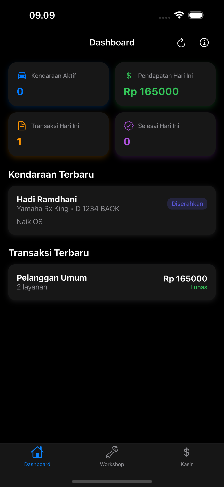
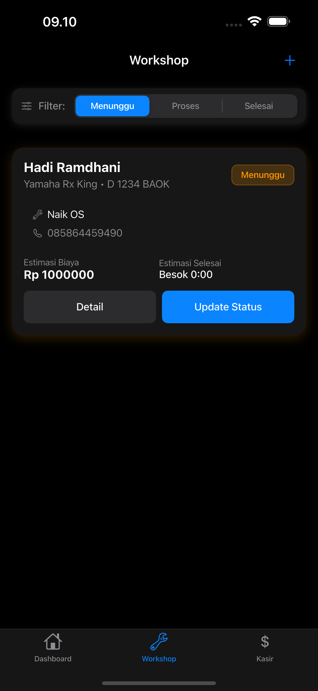
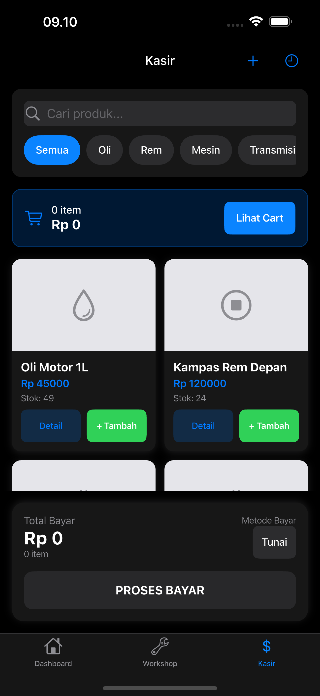
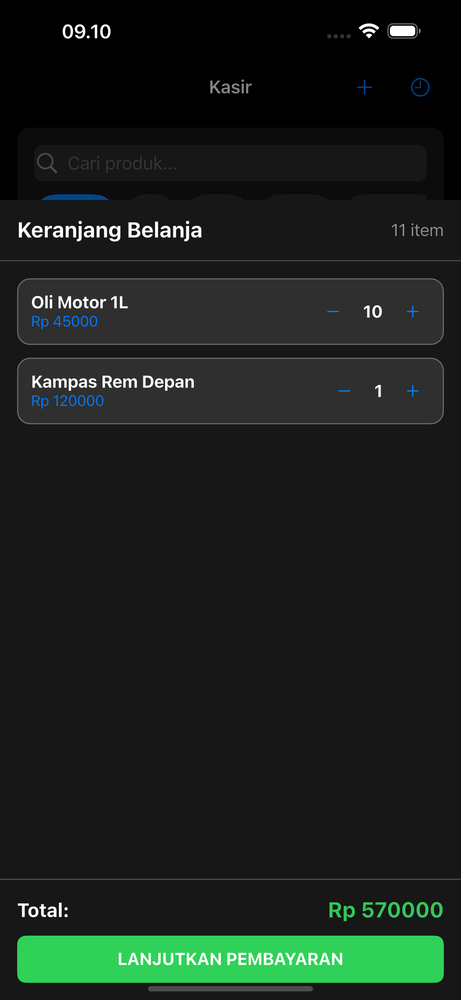
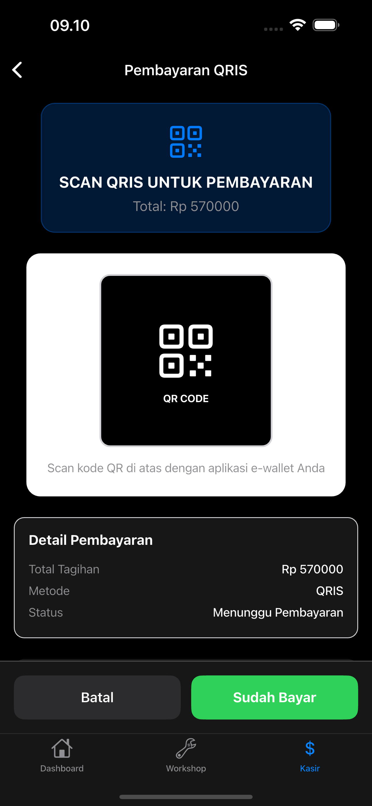
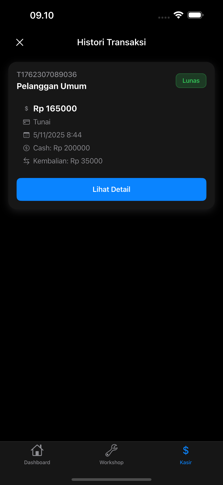
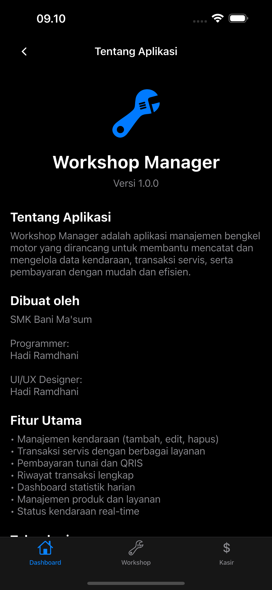

# Workshop Manager

Aplikasi manajemen workshop yang komprehensif untuk mengelola servis kendaraan, pembayaran, dan inventori produk.

## Fitur Utama

### 🏪 Manajemen Workshop
- **Pendaftaran Kendaraan**: Tambahkan kendaraan baru dengan detail pelanggan
- **Status Servis**: Pantau status servis (Menunggu, Proses, Selesai, Diserahkan)
- **Estimasi Biaya**: Hitung estimasi biaya servis
- **Pembayaran Workshop**: Proses pembayaran saat kendaraan selesai diservis

### 💰 Sistem Pembayaran
- **Multi Metode Pembayaran**: Tunai, QRIS, Transfer Bank
- **Input Uang Cash**: Interface khusus untuk pembayaran tunai dengan perhitungan otomatis
- **QRIS Payment**: Pembayaran digital melalui QRIS
- **Bank Transfer**: Informasi rekening untuk transfer bank
- **Struk Digital**: Bukti pembayaran digital yang dapat dibagikan

### 🛒 Manajemen Kasir
- **Keranjang Belanja**: Tambahkan produk ke keranjang
- **Katalog Produk**: Lihat dan cari produk berdasarkan kategori
- **Update Stok**: Otomatis update stok setelah transaksi
- **Riwayat Transaksi**: Lihat semua transaksi yang pernah dilakukan

### 📊 Dashboard
- **Ringkasan Harian**: Statistik transaksi harian
- **Grafik Penjualan**: Visualisasi data penjualan
- **Status Workshop**: Ringkasan status kendaraan di workshop

### 📱 Teknologi
- **Flutter**: Framework cross-platform
- **SQLite**: Database lokal untuk penyimpanan data
- **Cupertino Design**: UI/UX yang konsisten dengan iOS
- **Dark Theme**: Tampilan modern dengan tema gelap

## Instalasi

### Prasyarat
- Flutter 3.24.0 atau lebih baru
- Dart 3.0 atau lebih baru
- Android Studio / Xcode
- Git

### Langkah Instalasi

1. **Clone Repository**
```bash
git clone https://github.com/username/workshop_manager.git
cd workshop-manager
```

2. **Install Dependencies**
```bash
flutter pub get
```

3. **Jalankan Aplikasi**
```bash
# Untuk Android
flutter run -d android

# Untuk iOS
flutter run -d ios

# Untuk Web
flutter run -d chrome
```

## Build dan Release

### Build APK (Android)
```bash
flutter build apk --release
```

### Build IPA (iOS)
```bash
flutter build ios --release --no-codesign
```

### Build Web
```bash
flutter build web --release
```

## Struktur Proyek

```
lib/
├── main.dart                 # Entry point aplikasi
├── models/                   # Model data
│   ├── vehicle.dart         # Model kendaraan
│   ├── product.dart         # Model produk
│   ├── transaction.dart     # Model transaksi
│   └── cart_item.dart       # Model item keranjang
├── screens/                  # Screen/UI
│   ├── dashboard_screen.dart # Dashboard utama
│   ├── workshop_screen.dart  # Manajemen workshop
│   ├── cashier_screen.dart   # Kasir dan transaksi
│   ├── cash_input_screen.dart # Input pembayaran tunai
│   ├── qris_payment_screen.dart # Pembayaran QRIS
│   ├── receipt_screen.dart   # Struk pembayaran
│   └── ...
├── database/                 # Database helper
│   └── database_helper.dart  # SQLite operations
└── ...
```

## Fitur Pembayaran Workshop

### Flow Pembayaran
1. **Status Completed**: Ketika kendaraan statusnya "Selesai", tombol berubah menjadi "Serahkan Motor"
2. **Dialog Pembayaran**: Muncul dialog pilihan metode pembayaran
3. **Pilih Metode**: Pilih antara Tunai, QRIS, atau Transfer Bank
4. **Proses Bayar**: 
   - **Tunai**: Masukkan jumlah uang, otomatis hitung kembalian
   - **QRIS**: Scan kode QR untuk pembayaran digital
   - **Transfer**: Tampilkan informasi rekening bank
5. **Selesai**: Update status kendaraan menjadi "Diserahkan" dan buat transaksi

### Status Pembayaran
- **Sudah Dibayar**: Hijau dengan icon checkmark
- **Belum Dibayar**: Merah dengan icon peringatan
- Tampilkan di detail kendaraan dan card utama

## Kontribusi

1. Fork repository ini
2. Buat branch fitur (`git checkout -b feature/AmazingFeature`)
3. Commit perubahan (`git commit -m 'Add some AmazingFeature'`)
4. Push ke branch (`git push origin feature/AmazingFeature`)
5. Buat Pull Request

## Lisensi

Proyek ini dilisensikan di bawah MIT License - lihat file [LICENSE](LICENSE) untuk detail.

## Kontak

- Email: hadsxdev@icloud.com
- GitHub: [Hadi Ramdhani](https://github.com/0xHadiRamdhani)

## Changelog

### v1.0.0
- ✨ Sistem pembayaran workshop lengkap
- 🏪 Manajemen kendaraan dan status servis
- 💰 Multi metode pembayaran (Tunai, QRIS, Transfer)
- 📱 UI/UX modern dengan Cupertino design
- 📊 Dashboard dengan statistik
- 🔄 GitHub Actions untuk build otomatis

### v0.9.0
- 🏪 Manajemen workshop dasar
- 🛒 Sistem kasir untuk produk
- 📊 Dashboard awal
- 💾 Database SQLite lokal

---

## 📸 Screenshots

Berikut adalah tampilan aplikasi Workshop Manager:

<table>
  <tr>
    <td align="center">
      
      <br>
      <strong>Dashboard</strong>
    </td>
    <td align="center">
      
      <br>
      <strong>Daftar Kendaraan</strong>
    </td>
    <td align="center">
      
      <br>
      <strong>Kasir - Transaksi</strong>
    </td>
  </tr>
  <tr>
    <td align="center">
      
      <br>
      <strong>Keranjang Belanja</strong>
    </td>
    <td align="center">
      
      <br>
      <strong>Input Uang Cash</strong>
    </td>
    <td align="center">
      
      <br>
      <strong>Pembayaran QRIS</strong>
    </td>
  </tr>
  <tr>
    <td align="center">
      
      <br>
      <strong>Riwayat Transaksi</strong>
    </td>
    <td align="center">
      
      <br>
      <strong>Tentang Aplikasi</strong>
    </td>
    <td align="center">
      <br>
      <br>
      <strong></strong>
    </td>
  </tr>
</table>

---

**⭐ Jika proyek ini bermanfaat, jangan lupa untuk memberikan bintang!**
